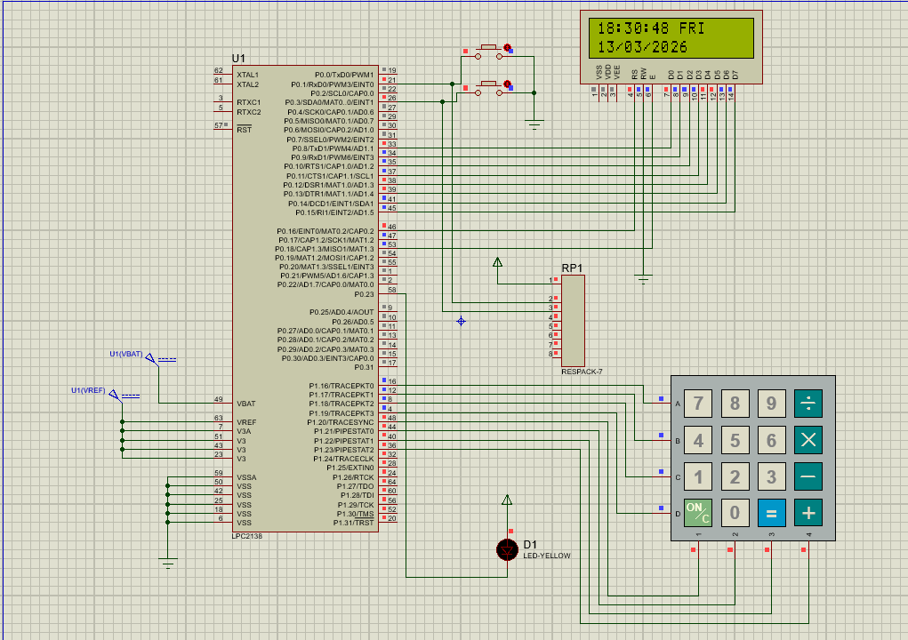
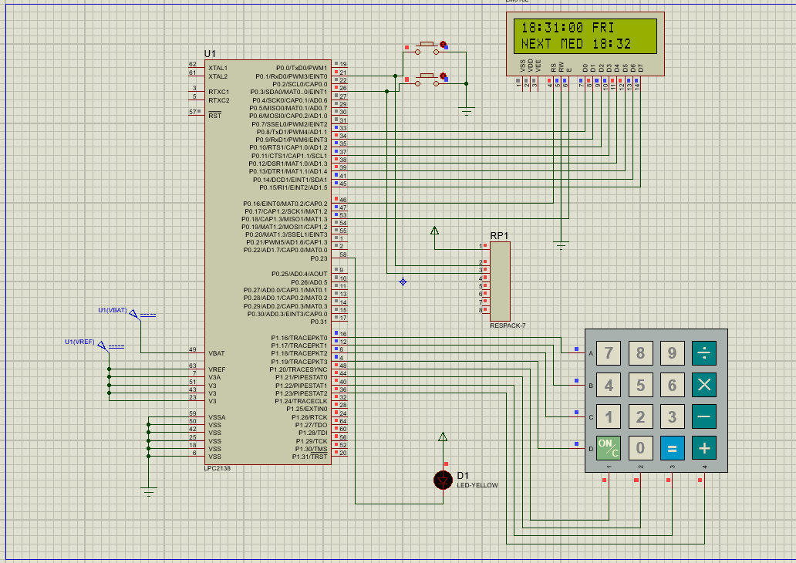
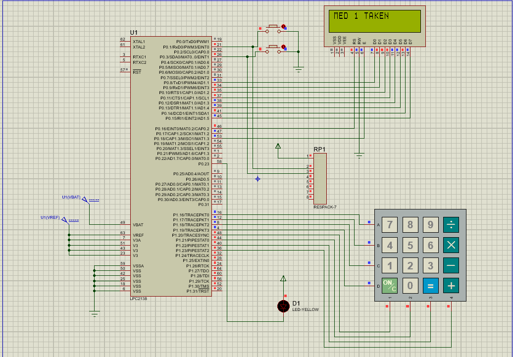

# LPC2148 Medicine Reminder System

Embedded C project using the LPC2148 ARM7 microcontroller to implement a user configurable medicine reminder system.  
The system allows users to set medicine timings and provides alerts using LCD messages and buzzer notifications.

---

## Block Diagram


---

## Overview

This project implements a real-time medicine reminder system using the LPC2148 microcontroller.  
The system continuously monitors time using the Real Time Clock (RTC) and compares it with the user-configured medicine schedule.

When the current time matches the stored medicine time, the system generates an alert using a buzzer or LED and displays a reminder message on the LCD display.

Users can configure the system through a 4x4 matrix keypad interface. The system also supports interrupt-based controls using external switches.

---

## Features

- Real Time Clock (RTC) based monitoring
- LCD display for time, date, and alerts
- User configurable medicine scheduling
- 4x4 matrix keypad input system
- Buzzer alert for medicine reminders
- Interrupt based user interaction
- Menu driven configuration
- Menu timeout protection
- Multiple medicine schedule support

---

## Hardware Components

The system uses the following hardware components:

- LPC2148 ARM7 Microcontroller
- 16x2 LCD Display
- 4x4 Matrix Keypad
- Buzzer or LED Alert
- Push Buttons (Switch 1 and Switch 2)
- Power Supply
- USB-UART / DB9 Cable (for programming)

---

## Software Tools

The project is developed using the following software tools:

- Embedded C Programming Language
- Keil uVision IDE
- Flash Magic

---

# Proteus Simulation

## RTC Time Display



This image shows the RTC displaying the current time and date on the LCD.  
The system continuously reads time from the RTC registers and updates the display.

---

## Menu Display


When **Switch 1 (EINT0)** is pressed, the menu appears on the LCD.  
The menu allows the user to configure:

```
1.TIME
2.DAY
3.MED
4.EXIT
```

The keypad is used to select these options.

---

## Next Medicine Display



After configuring medicine timings, the system calculates the next scheduled medicine time.  
The LCD displays the **next medicine reminder time**.

---

## Medicine Reminder Alert


When the RTC time matches a configured medicine schedule:

- LCD displays **TAKE MED X**
- Buzzer or LED alert is activated
- The system waits for user acknowledgement

---

## Medicine Acknowledgement



When the user presses **Switch 2 (EINT1)**:

- The alert stops
- LCD displays **MED X TAKEN**
- System resumes monitoring for the next medicine time

---

## System Operation

### 1. System Initialization

When the system starts, the following modules are initialized:

- Real Time Clock (RTC)
- LCD Display
- Keypad Interface
- External Interrupts

After initialization, the LCD begins displaying the current time and date.

---

### 2. Menu Access

The user presses **Switch 1 (EINT0)** to enter the configuration menu.

The LCD displays menu options such as:

```
1.TIME   2.DAY
3.MED    4.EXIT
```

The keypad is used to select the required option.

---

### 3. Time and Date Configuration

Using the menu, the user can update:

- Current time
- Current date
- Day of the week

The input is entered through the keypad and stored in the RTC registers.

---

### 4. Medicine Schedule Configuration

The user can configure multiple medicine timings.

For each medicine:
- Hour is entered
- Minute is entered
- The schedule is stored in memory

The system also checks for duplicate medicine timings.

---

### 5. Real-Time Monitoring

The system continuously reads the current time from the RTC module and compares it with stored medicine schedules.

---

### 6. Medicine Alert

When the RTC time matches a scheduled medicine time:

- LCD displays **TAKE MED X**
- Buzzer or LED alert is activated

The system waits for user acknowledgement.

---

### 7. User Acknowledgement

The user presses **Switch 2 (EINT1)** to confirm medicine intake.

After acknowledgement:

- Buzzer or LED is turned OFF
- LCD displays **MED X TAKEN**
- The system shows the next scheduled medicine time

---

### 8. Missed Medicine Handling

If the user does not acknowledge within the allowed time:

- The system marks the medicine as **MISSED**
- Alert stops automatically
- System resumes normal monitoring

---

## Interrupt Functionality

Two external interrupts are used:

| Interrupt | Function |
|--------|--------|
| EINT0 (Switch 1) | Opens configuration menu |
| EINT1 (Switch 2) | Acknowledges medicine reminder |

Interrupts allow quick user interaction without stopping the main program.

---

## Menu Timeout Protection

To avoid leaving the system in menu mode accidentally:

- The system monitors user inactivity
- If no input is detected for **30 seconds**
- The menu automatically exits
- The system returns to normal monitoring mode

---

## Project Structure

### Source Files

```
main_project.c
rtc_.c
lcd.c
kpm_prototype.c
medicine.c
menu.c
inter_mp.c
delay.c
```

### Header Files

```
types.h
medicine.h
config.h
interrupt.h
menu.h
rtc.h
lcd.h
kpm_defines.h
lcd_defines.h
delay.h
```

---

## Author

Phani Doranala  
Embedded Systems Project  
LPC2148 Medicine Reminder System
---


