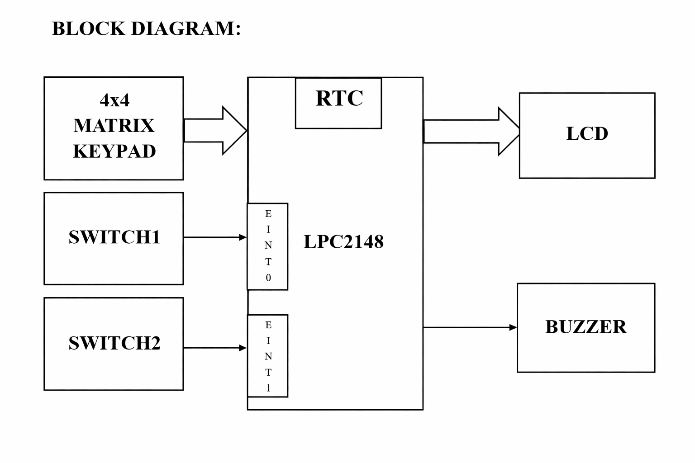
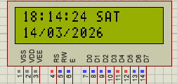
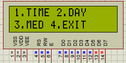
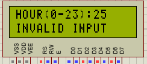
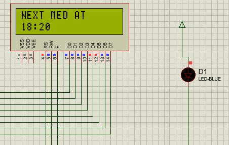
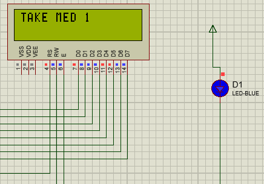
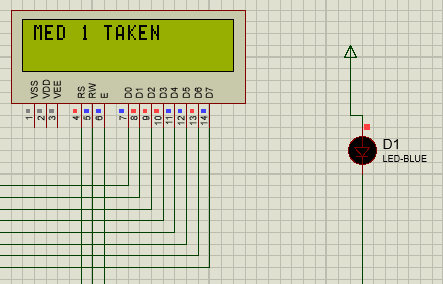

# LPC2148 Medicine Reminder System

Embedded C project using the LPC2148 ARM7 microcontroller to implement a user configurable medicine reminder system.
The system allows users to set medicine timings and provides alerts using LCD messages and buzzer notifications.

---

## Block Diagram

---

## Overview

This project implements a real-time medicine reminder system using the LPC2148 microcontroller.
The system continuously monitors time using the Real Time Clock (RTC) and compares it with the user-configured medicine schedule.

When the current time matches the stored medicine time, the system generates an alert using a buzzer or LED and displays a reminder message on the LCD display.

Users can configure the system through a 4x4 matrix keypad interface. The system also supports interrupt-based controls using external switches.

---

## Working Principle

The system works based on real-time comparison between RTC time and stored medicine schedules.

1. RTC continuously updates time
2. User sets medicine timings
3. System compares both values
4. If match occurs → Alert triggered
5. User acknowledges → System resets

---

## Features

* RTC based monitoring
* LCD display (time/date/alerts)
* User configurable medicine schedule
* 4x4 keypad input
* Buzzer/LED alert
* Interrupt-based control
* Menu-driven system
* Timeout protection
* Multiple medicine support

---

## Hardware Components

* LPC2148 Microcontroller
* 16x2 LCD
* 4x4 Keypad
* Buzzer/LED
* Push Buttons
* Power Supply

---

## Software Tools

* Embedded C
* Keil uVision
* Flash Magic

---

# Proteus Simulation

## RTC Time Display

---

## Menu Display

---

## Invalid Input

---

## Next Medicine

---

## Medicine Alert

---

## Acknowledgement

---

## System Operation

### Initialization

* RTC, LCD, Keypad, Interrupts initialized

### Menu

* Press **SW1 (EINT0)**

### Scheduling

* Enter time via keypad

### Monitoring

* Continuous RTC comparison

### Alert

* LCD + buzzer ON

### Acknowledge

* Press **SW2 (EINT1)**

---

## Interrupts

| Interrupt | Function    |
| --------- | ----------- |
| EINT0     | Menu        |
| EINT1     | Acknowledge |

---

## Author

**Phani Doranala**
Embedded Systems Project
LPC2148 Medicine Reminder System
